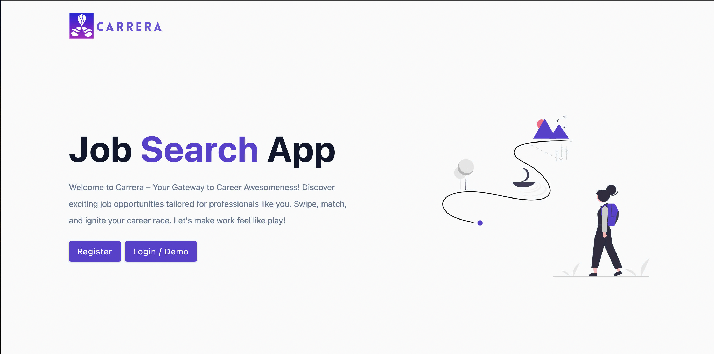

# Carrera

Welcome to Carrera, your go-to app for efficiently managing and tracking your job search process. Whether you're actively seeking new opportunities or just exploring the market, Carrera is designed to streamline and organize your job hunt.



This project was generated with <span style="color:green">REACT + VITE</span>

## How to Use

1. Register.
2. Login.
3. Add a job.
4. View all jobs.

## Limitations

The app will be updated to add more functionalities such as:

1. Editing, deleting and updating jobs from the front-end. These features are working and tested in the back-end using Thunder Client.
2. The Stats section.
3. The Profile section.

## Future Plans

We're committed to continuously improving your job search experience. In the future, we plan to expand Carrera into a comprehensive Job Search Platform with an API. This will enable seamless integration with other tools, personalized job recommendations, and enhanced collaboration features.

Stay tuned for updates as we work towards making JobTracker your one-stop solution for a successful job search journey!

## Installation

### Clone the Repository

Open your terminal and run the following command to clone the repository to your local machine:

```bash
git clone git@github.com:christianpsamson/Samson_Christian_JobNavigator_Capstone.git
```

### Install Dependencies

Run the following command to install the project dependencies using npm:

```bash
npm install
```

### Start the App:

After the installation is complete, start the app using the following command:

```bash
node server
```

This will launch the JobTracker app, and you can access it by opening your browser and navigating to http://localhost:5100.
